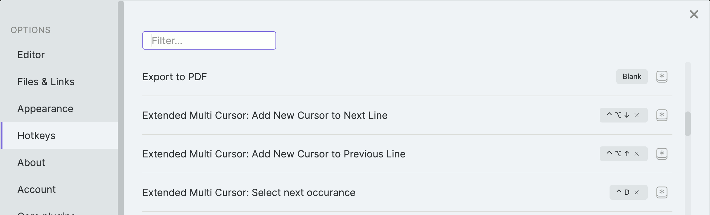

## Enhanced Multi Cursor

This plugin expands on Obsidian's default multi-cursor support.

If you want more advanced options, see [Advanced Cursors](https://github.com/SkepticMystic/advanced-cursors) by SkepticMystic.

## De-Select

When you Alt-Click on an existing selection, remove it.
For those times when you accidentally put a cursor in the middle of a word.
Can be enabled/disabled in the plugin settings.

## Keybindings

Control multiple cursors with your keyboard! Currently only supports basic Sublime Text actions, PRs welcome!
This plugin creates the following new commands:

- **Select next occurance** (Ctrl-D)
- **Add New Cursor to Previous Line** (Ctrl-Alt-Up)
- **Add New Cursor to Next Line** (Ctrl-Alt-Down)

These commands can be found and re-mapped in the Obsidian Hotkey editor. By default they use the same keybindings as Sublime text.

